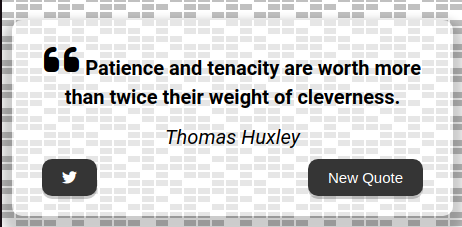

## Quote Generator Project Documentation

### Overview

The Quote Generator is a web application that serves up random quotes to users, offering inspiration with each click. It is built to fetch quotes from an online JSON file, allowing users to either enjoy a new quote or share their favorite ones on Twitter. The design focuses on a responsive and interactive user experience, utilizing a combination of HTML, CSS, and JavaScript.

- [Repository](https://github.com/Mahir33/p-quote-generator)
- [GitHub Pages](https://mahir33.github.io/p-quote-generator/)
- [Author: Mahir33](https://github.com/Mahir33)

### Technologies Used

The project leverages several key technologies:

- **HTML:** The backbone of the application, used to structure the content on the web page.
- **CSS:** Provides the styling required to make the application visually appealing and ensures it is responsive across different device sizes.
- **JavaScript:** Adds interactivity to the web application, handling the fetching of quotes from an external JSON file and updating the webpage dynamically.
- **Font Awesome:** A popular web font and icon toolkit used for adding visually appealing icons, such as the Twitter logo and quote marks.
- **Fetch API:** A modern interface used in JavaScript to make HTTP requests to external resources, in this case, the JSON file containing the quotes.

### Features

The application boasts several notable features:

- **Display Random Quotes:** Users can generate a new random quote by clicking the "New Quote" button. Each click fetches a new quote and its author from the JSON file and displays them on the page.
- **Tweet Quotes:** A Twitter button allows users to share the displayed quote on their Twitter account. This feature dynamically constructs a tweet containing the quote and its author, facilitating easy sharing.
- **Responsive Design:** The application is designed to be fully responsive, ensuring a seamless user experience across various devices and screen sizes.

### File Structure

The project is organized into three main files:

- **HTML File (`index.html`):** This file contains the structural markup of the application, including the quote container, buttons for generating new quotes and sharing on Twitter, and links to external CSS and Font Awesome icons.
- **CSS File (`style.css`):** It styles the application, ensuring that the layout is both responsive and aesthetically pleasing.
- **JavaScript File (`script.js`):** This script contains the logic for fetching quotes from the JSON file, displaying them in the document, and updating the Twitter share link.

### External Resources

The application utilizes external resources for enhanced functionality and design:

- **Font Awesome:** For adding icons to the application, enhancing the visual appeal.
- **Google Favicon:** Utilizes Google's favicon service for fetching a favicon for the application, adding a professional touch to the tab icon.
- **CDNJS:** Serves the Font Awesome CSS file, ensuring icons are up-to-date and accessible.

### How to Use

1. **Viewing a Quote:** Upon loading the application, users are presented with a basic quote. A new random quote can be displayed by clicking the "New Quote" button.
2. **Sharing a Quote:** Users can share a quote on Twitter by clicking the Twitter icon button. This action opens Twitter in a new tab, with a pre-filled tweet containing the quote and its author, ready for sharing.
